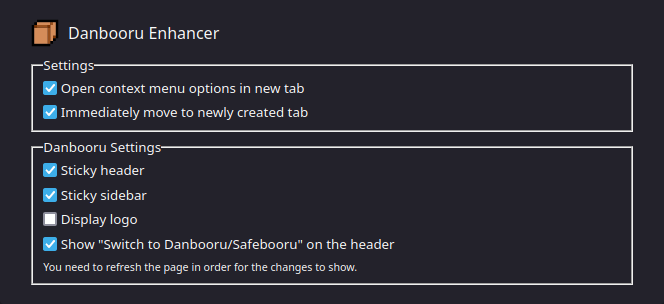

# Danbooru Enhancer

A browser extension to extend [Danbooru](https://safebooru.donmai.us/) site
and help its users/contributors.

This extension is Firefox only at the moment. Chrome extension may be planned in the future.

## Features

- [Post image/search artists in Danbooru using right-click context menu](./assets/context_menu.png)
- Make Danbooru's header sticky
- Make Danbooru's sidebar sticky
- Hide Danbooru's logo and text
- Quicky switch from Danbooru to Safebooru (and vice versa)

And more to come.

## Building

1. Install [bun](https://bun.sh/)
2. Run `bun install`
3. Run `bun run index.ts`
4. The build files (including the `manifest.json` file) should be now in the folder called `./dist`

## License

Danbooru Enhancer is licensed under the MIT-0 license. See the [LICENSE](./LICENSE) file.
